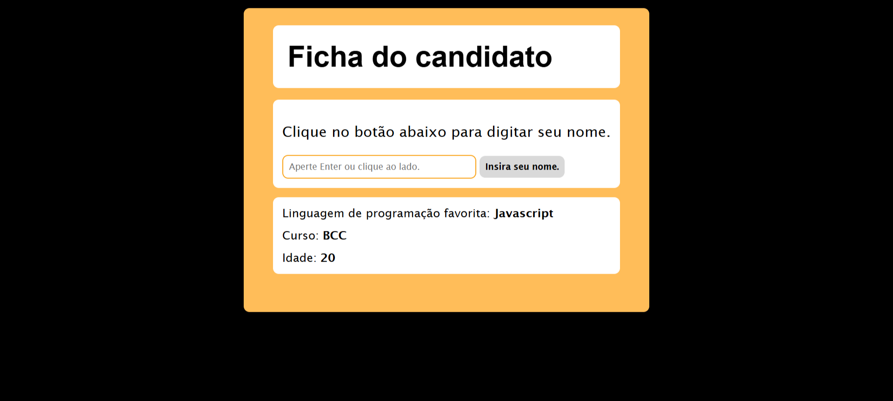

# Desafio 1 - No Memory Forms

Você já conhece as principais tags HTML e como estilizar fontes e listas utilizando CSS. Que tal fixarmos o conteúdo visto?

Este repóstorio contém uma página parcialmente estruturada e estilizada. Sua tarefa é **selecionar as tags e as regras CSS adequadas para que a página fique semelhante a esta**:

Para isso, você precisará modificar os arquivos [index.html](index.html) e [d1.css](assets/styles/d1.css).

**Não se preocupe!** Os monitores estão a disposição para responder qualquer dúvida.